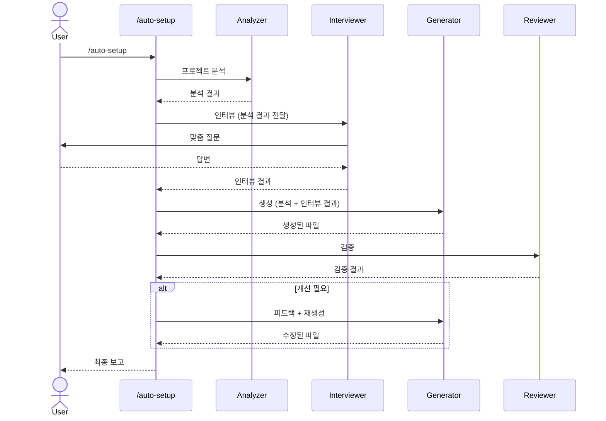

# claude-auto-setup-plugin

프로젝트를 분석하고 맞춤 인터뷰를 통해 `.claude/` 설정을 자동 생성하는 멀티 에이전트 파이프라인.

## 개요

`/init`은 기본적인 CLAUDE.md만 생성하지만, 이 플러그인은 프로젝트에 맞는 완전한 `.claude/` 세팅을 만들어줍니다:

- **CLAUDE.md** - 프로젝트 컨벤션, 아키텍처, 주의사항
- **Rules** - 프로젝트 특화 코딩 규칙
- **Skills** - 반복 작업 자동화 스킬

## 파이프라인 구조



## 에이전트 구성

| 에이전트 | 모델 | 역할 |
|---------|------|------|
| **setup-analyzer** | haiku | 프로젝트 구조 분석 (빠른 분석) |
| **setup-interviewer** | sonnet | 분석 결과 기반 맞춤 인터뷰 |
| **setup-generator** | sonnet | CLAUDE.md, rules, skills 생성 |
| **setup-reviewer** | sonnet | 품질 검증 + 피드백 루프 |

## 설치

```bash
git clone https://github.com/yhyuk/claude-auto-setup-plugin.git
cd claude-auto-setup-plugin
chmod +x install.sh
./install.sh
```

`commands/`, `agents/`, `skills/`가 `~/.claude/`에 복사되어 모든 프로젝트에서 사용 가능합니다.

## 사용법

아무 프로젝트에서 Claude Code를 열고:

```
/auto-setup
```

파이프라인이 순차적으로 실행됩니다:
1. 프로젝트 분석 (언어, 프레임워크, 구조 파악)
2. 맞춤 인터뷰 (3-4개 핵심 질문 + 선택적 심화 질문)
3. 설정 파일 생성 (CLAUDE.md, rules, skills)
4. 품질 검증 (형식, 내용, 누락 체크)

## 프로젝트 구조

```
claude-auto-setup-plugin/
├── README.md              # 영문 README
├── README.ko.md           # 한국어 README
├── commands/
│   └── auto-setup.md      # 커맨드 진입점
├── agents/
│   ├── setup-analyzer.md  # 분석 에이전트
│   ├── setup-interviewer.md # 인터뷰 에이전트
│   ├── setup-generator.md # 생성 에이전트
│   └── setup-reviewer.md  # 검증 에이전트
├── skills/
│   └── auto-setup/
│       └── SKILL.md       # 오케스트레이터 (메인)
└── install.sh             # 설치 스크립트
```

## 지원 기술 스택

- **Java**: Spring Boot, Maven/Gradle
- **TypeScript/JavaScript**: Next.js, React, Vue, Express, NestJS
- **Python**: Django, FastAPI, Flask
- **Go**, **Rust** 등

Analyzer가 기술 스택을 자동 감지하고, Interviewer가 해당 스택에 맞는 질문을 합니다.

## 차별점 (vs /init)

| | /init | /auto-setup |
|---|---|---|
| CLAUDE.md | 자동 생성 (기본) | 인터뷰 기반 맞춤 생성 |
| Rules | 미생성 | 프로젝트 규칙 생성 |
| Skills | 미생성 | 반복 작업 스킬 생성 |
| 인터뷰 | 없음 | 프레임워크별 맞춤 질문 |
| 품질 검증 | 없음 | Reviewer 에이전트 검증 |

## 라이선스

MIT
