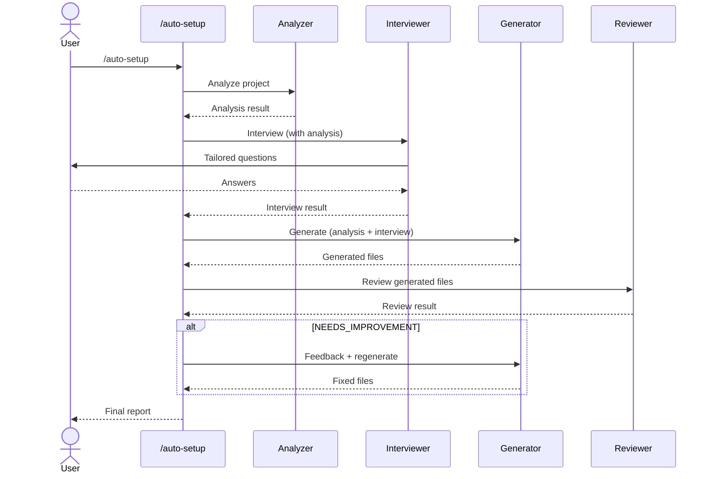

# claude-auto-setup-plugin

A multi-agent pipeline that automatically sets up `.claude/` configuration for any project through intelligent analysis and interactive interview.

## Overview

Unlike `/init` which only generates a basic `CLAUDE.md`, this plugin creates a complete `.claude/` setup tailored to your project:

- **CLAUDE.md** - Project conventions, architecture, and important patterns
- **Rules** - Coding rules and constraints specific to your project
- **Skills** - Automated workflows for repetitive tasks

## Pipeline Architecture



## Agents

| Agent | Model | Role |
|-------|-------|------|
| **setup-analyzer** | haiku | Fast project structure analysis |
| **setup-interviewer** | sonnet | Tailored interview based on analysis |
| **setup-generator** | sonnet | Generate CLAUDE.md, rules, skills |
| **setup-reviewer** | sonnet | Quality validation + feedback loop |

## Install

```bash
git clone https://github.com/yhyuk/claude-auto-setup-plugin.git
cd claude-auto-setup-plugin
chmod +x install.sh
./install.sh
```

This copies `commands/`, `agents/`, and `skills/` to `~/.claude/`, making `/auto-setup` available in all projects.

## Usage

Open Claude Code in any project and run:

```
/auto-setup
```

The pipeline will:
1. Analyze your project (language, framework, structure)
2. Ask tailored questions based on analysis
3. Generate customized `.claude/` configuration
4. Validate generated files for quality

## Project Structure

```
claude-auto-setup-plugin/
├── README.md
├── README.ko.md
├── commands/
│   └── auto-setup.md          # Command entry point
├── agents/
│   ├── setup-analyzer.md      # Project analysis
│   ├── setup-interviewer.md   # Tailored interview
│   ├── setup-generator.md     # File generation
│   └── setup-reviewer.md      # Quality review
├── skills/
│   └── auto-setup/
│       └── SKILL.md           # Orchestrator (primary)
└── install.sh                 # Install script
```

## Supported Stacks

- **Java**: Spring Boot, Maven/Gradle
- **TypeScript/JavaScript**: Next.js, React, Vue, Express, NestJS
- **Python**: Django, FastAPI, Flask
- **Go**, **Rust** and more

The analyzer detects your stack automatically and the interviewer asks relevant questions.

## License

MIT
